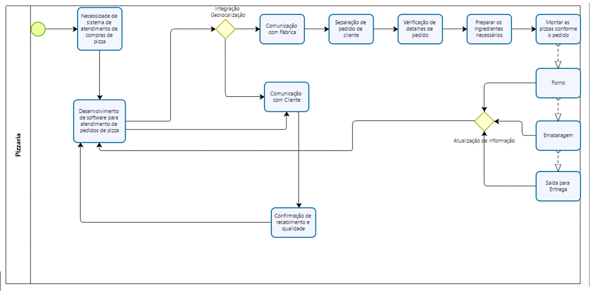
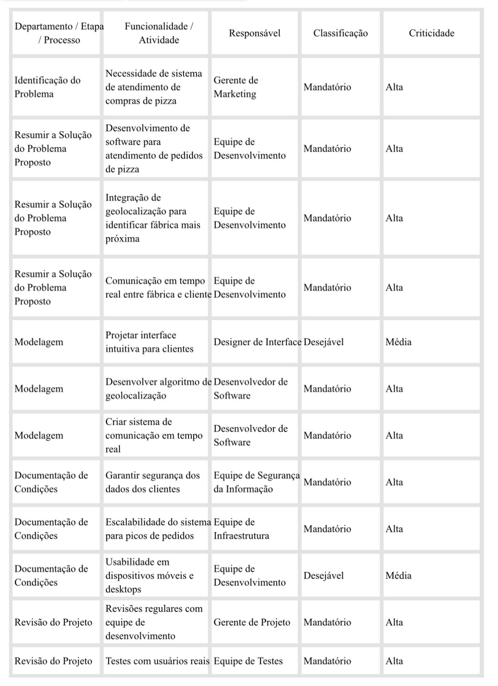
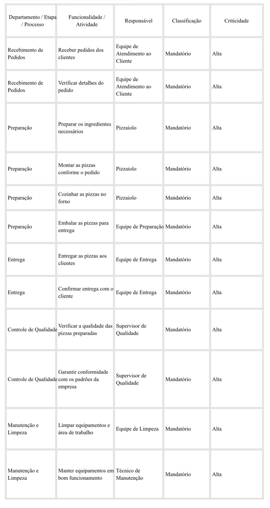
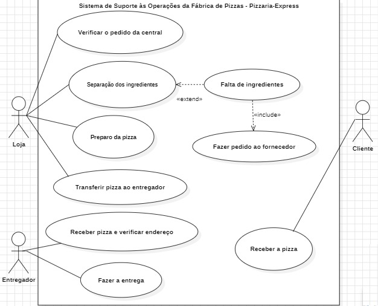
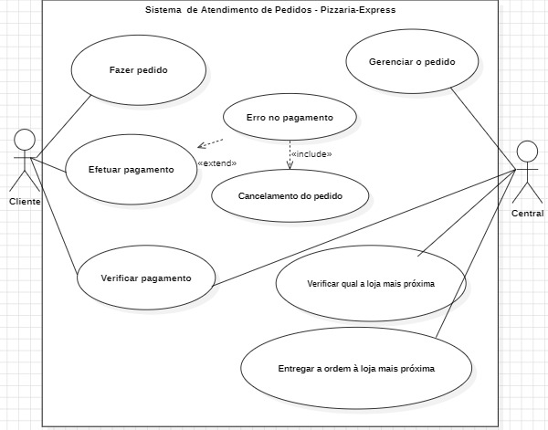
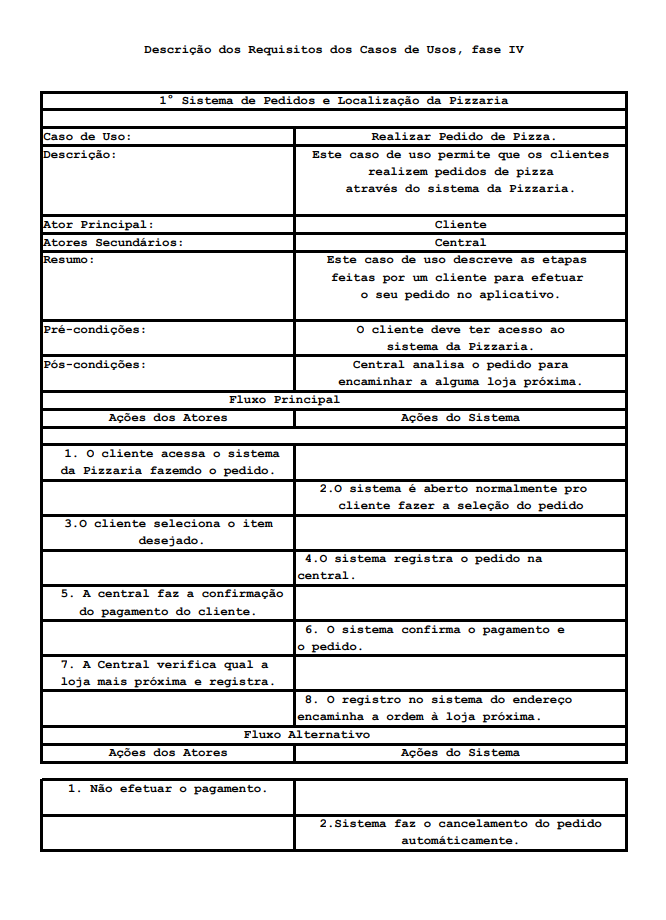
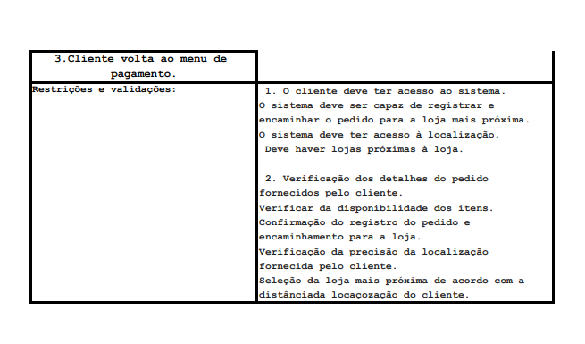
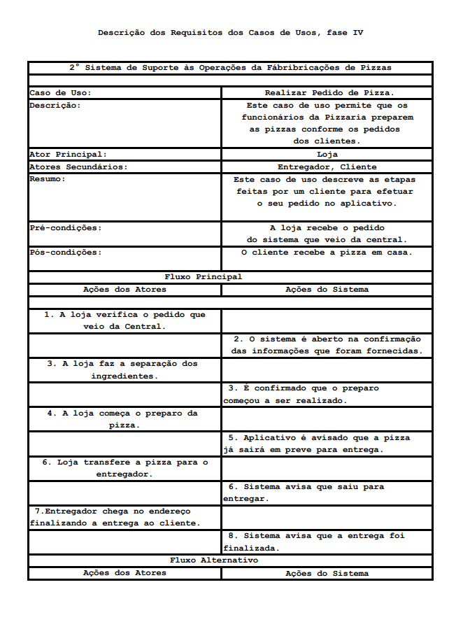
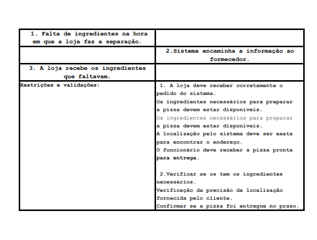

<h2><a href= "https://www.mackenzie.br">Universidade Presbiteriana Mackenzie</a></h2>
<h3><a href= "https://www.mackenzie.br/graduacao/sao-paulo-higienopolis/sistemas-de-informacao">Sistemas de Informação</a></h3>

*&lt;Pizza-Express&gt;*

**Conteúdo**

- [Autores](#autores)
- [Descrição do Projeto](#descrição-do-projeto)
- [Diagrama de Atividades](#diagrama-de-atividades)
- [Analise de Requisitos](#analise-de-requisitos)
- [Diagrama dos Casos de Uso](#diagrama-dos-casos-de-uso)
- [Descriçao Requisitos de Caso de Uso](#descriçao-requisitos-de-caso-de-uso)

# Autores

* Lucas Sanches Coelho | ra: 10410045
* Yan Correa Santos | ra: 10426549
* Sara de Oliveira Silva Omena | ra: 10425441

# Descrição do Projeto

<h3> Tema e Contexto do Projeto podem ser encontados em <a href="arqs/Tema e Contexto do Projeto.pdf">"Tema e Contexto"</a></h3>

*&lt;Pizza-Express tem perdido recentemente 30% do rendimento de vendas
devido a um problema em seu negócio da entrega. Atribuem este
problema a seu concorrente principal que promoveu um programa que
garante o serviço de entrega em 30 minutos, desde a entrada da
ordem de serviço até a entrega na casa do cliente (delivery).  
Pizza-Express anuncia a entrega em uma hora.  
Pizza-Express usa atualmente computadores para armazenar as
operações e as funções usuais do negócio, mas não auxiliam nas
funções para processar a entrega dos pedidos dos seus clientes.  
Elonn Muske, o gerente de sistemas de informação é o encarregado
para desenvolver uma aplicação do software para identificar a
localização de lojas de pizza Pizza-Express mais próxima do cliente
e para criar o sistema de software necessário para operá-las.  
O patrocinador deste projeto, a empresa Papa-Léguas Delivery,
disse que o futuro da Pizza-Express depende deste projeto.  
A equipe deverá investigar uma opção para entregar a pizza em menos
de 30 minutos. 
A sua idéia é montar lojas de pizza Pizza-Express que não teriam
nenhum espaço de varejo, pois a sua função é somente receber
ordens, preparar e entregar as pizzas.  
A loja deverá ser localizada o mais próximo do cliente receberá a
ordem através de uma central, processará, e entregará a ordem
dentro de 10 ou 15 minutos da entrada do pedido.  
Há dois projetos do desenvolvimento do software identificados
aqui:
primeiro é um sistema de software para o atendimento do pedido e
para encontrar localização da fábrica da pizza mais próxima do
cliente para fazer a entrega; e
segundo é um sistema de software para suportar operações da fábrica
de pizzas.
Importante: Dá equipe se exigem profissionalismo e colaboração
mútua.&gt;*

# Diagrama de Atividades

# Analise de Requisitos

*Analises dos Requisitos*
   

# Diagrama dos Casos de Uso

# Descriçao Requisitos de Caso de Uso

Pag 1  
Pag 2
     

Pag 1 
Pag 2 

  

